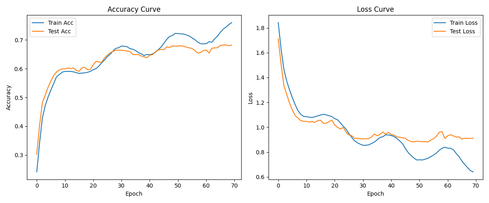
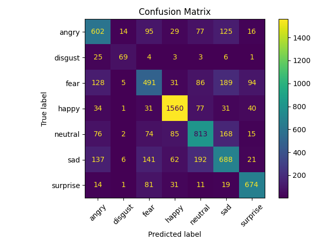

# Real-Time-Emotion-Recognition: 基于 CNN 的实时面部表情分析系统
## 1. 项目简介

本项目实现了一个端到端的情感识别系统，能够通过摄像头实时捕捉人脸并识别其情绪。系统基于深度卷积神经网络（CNN）构建，支持 7 类情感分类：生气 (Angry)、厌恶 (Disgust)、恐惧 (Fear)、开心 (Happy)、中性 (Neutral)、悲伤 (Sad) 以及惊喜 (Surprise)。

## 2. 核心功能

* **实时视频流分析**：集成 OpenCV Haar 级联分类器进行人脸检测，并结合训练好的深度模型进行毫秒级实时预测。
* **深度 CNN 架构**：自定义三层卷积块结构，采用批量归一化（BatchNorm）与 LeakyReLU 激活函数，提升模型收敛速度与特征提取能力。
* **鲁棒的数据增强**：在训练阶段应用了随机翻转、旋转、平移及归一化处理，增强了模型在不同角度及光照环境下的稳定性。
* **详尽的评估体系**：自动生成训练准确率/损失曲线，并计算混淆矩阵，帮助量化模型在各个情感维度上的偏置。

## 3. 技术栈

* **深度学习框架**：PyTorch
* **计算机视觉库**：OpenCV (用于人脸检测与视频流处理)
* **图像预处理**：PIL, Torchvision
* **指标分析**：Scikit-learn (混淆矩阵), Matplotlib

## 4. 目录结构

```text
├── emotion_model.py        # 模型定义：3层卷积块 + 全连接层
├── train_emotion.py        # 训练逻辑：含数据增强、余弦退火学习率策略及评估
├── webcam_emotion.py       # 实时检测：调用摄像头进行人脸捕获与实时分类
├── predict_image.py        # 静态预测：对单张图片进行推理测试
├── emotion_cnn_model.pth   # 训练好的 .pth 权重文件
├──training_curves.png / confusion_matrix.png # 训练产出的可视化指标，直观展示模型收敛情况与各类别识别精度。
└── README.md
```

## 5. 快速上手

### 5.1 环境安装

```bash
pip install torch torchvision opencv-python pillow scikit-learn matplotlib

```

### 5.2 准备数据

将数据集按以下结构存放：

```text
/train
    /happy, /sad, ... (子文件夹)
/test
    /happy, /sad, ... (子文件夹)

```

### 5.3 运行

1. **启动训练**：`python train_emotion.py`
2. **实时推理**：`python webcam_emotion.py` (确保连接了摄像头)

## 6. 模型规格

* **输入尺寸**：48x48 灰度图像
* **优化器**：Adam (Learning Rate: 0.001)
* **学习率调度**：CosineAnnealingLR
* **训练周期**：70 Epochs

## 7. 实验结果与可视化
模型经过 70 轮（Epochs）训练，最终在测试集上达到了较好的收敛效果。

### 7.1 训练曲线
通过记录每一轮的 Loss 和 Accuracy，可以看到模型在训练集和验证集上的表现同步提升，有效抑制了过拟合。


### 7.2 混淆矩阵
混淆矩阵展示了模型对 7 类情感的具体分类情况。从图中可以看出，模型在“开心（Happy）”和“惊讶（Surprise）”上的识别率极高，而对“恐惧（Fear）”和“悲伤（Sad）”的区分仍有提升空间，这表明面部表情识别较难识别恐惧和悲伤。


## 8. 预测示例
本项目提供了两种预测方式：

1. **单张图片预测**：
   运行 `predict_image.py`，输入图片路径，模型将输出最可能的情感类别及置信度。
   ```bash
   python predict_image.py --image_path test_sample.jpg
2. **实时摄像头预测**：
    运行 webcam_emotion.py，系统将自动调用人脸检测算子并在视频流中实时标注情绪。


---
